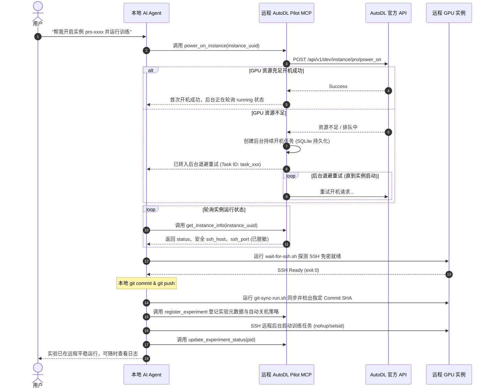

# 本地 AI Agent 与 AutoDL 协同工作流指南

本文档指导在本地运行的 AI Agent 如何配合远程 AutoDL Pilot MCP 服务完成完整的 GPU 实例生命周期管理、SSH 免密配置、Git 代码一致性检出与后台实验运维。

---

## 架构原则与安全边界

1. **职责分离**：
   - **远程 MCP 服务**：负责与 AutoDL 官方 API 通信，控制开机/持续重试/关机，持久化任务状态，过滤敏感密码，并生成安全连接配置。
   - **本地 AI Agent**：持有本地 SSH 私钥（私钥永不上传远端 MCP），负责本地代码编写、Git 提交、通过 SSH 免密登录 AutoDL 实例、拉取代码与执行实验。
2. **零敏感信息泄露**：
   - AutoDL 官方 snapshot 接口返回的 `root_password` 由 MCP 服务自动拦截并剥离，本地 Agent 仅通过生成的公私钥对登录。

---

## 一、SSH 免密登录初始化（一次性准备）

在首次使用前，由本地 Agent 或用户在开发机运行初始化脚本：

```bash
bash src/client-workflow/ssh-init.sh
```

该脚本将执行以下步骤：
1. **生成独立密钥**：生成专用的 Ed25519 密钥对 `~/.ssh/id_ed25519_autodl`，避免修改或影响默认的 `id_rsa`。
2. **权限保护**：确保私钥权限为 `0600`，`.ssh` 目录为 `0700`。
3. **配置公钥到 AutoDL 控制台**：
   - 复制打印出的 `~/.ssh/id_ed25519_autodl.pub` 公钥内容。
   - 登录 [AutoDL 控制台](https://www.autodl.com) -> 控制台中心 -> 账号设置 -> **SSH公钥** -> 点击「添加公钥」。
   - **效果**：所有新开机和重启的容器实例，AutoDL 系统都会自动将此公钥注入到 `/root/.ssh/authorized_keys` 中。
4. **配置 `~/.ssh/config`**：
   - 设置 `StrictHostKeyChecking accept-new`，自动信任新动态节点，避免因交互式 `yes/no` 提示导致 Agent 挂起。
   - 配置心跳保活 `ServerAliveInterval 30`。

---

## 二、私有 Git 仓库认证方案

若实验代码存放于私有 Git 仓库，AutoDL 实例默认无权 clone。推荐以下三种方案之一：

### 方案 1：只读 Personal Access Token (PAT) —— 推荐
在 GitHub / GitLab 生成一个仅具备 `Contents: Read-only` 权限的 Token。
在本地运行实验脚本时传入环境变量：
```bash
export GIT_AUTH_TOKEN="github_pat_xxxx"
bash src/client-workflow/git-sync-run.sh <HOST> <PORT> "https://github.com/your-org/private-repo.git" "/root/autodl-tmp/repo" "python train.py"
```
脚本会自动在远端构造安全认证 URL，无需将全权密码写入远程。

### 方案 2：Deploy Key（仓库部署只读公钥）
在本地生成一个专用部署公钥，或在 AutoDL 实例上生成临时公钥，添加到 GitHub 仓库的 `Settings -> Deploy Keys`（勾选只读）。

### 方案 3：SSH Agent Forwarding（SSH 密钥代理转发）
在本地运行 `ssh-add ~/.ssh/id_ed25519_github`，并在 SSH 连接时携带 `-A` 参数，直接复用本机的 GitHub 认证凭据。

---

## 三、AI Agent 完整执行流程（端到端）


